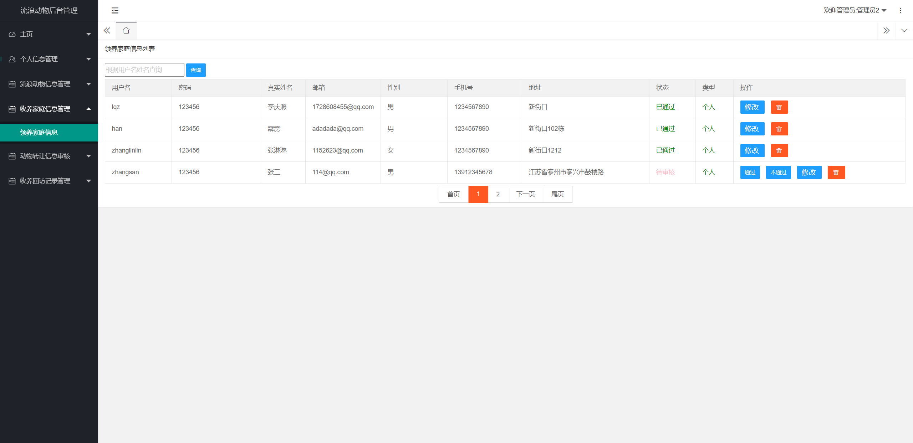

## 基于JSP+Servlet实现的流浪动物救助网站系统(程序+报告)

###  获取sql数据库文件: 从戎源码网 (https://armycodes.com/) QQ: 386869957 QQ群: 377586148
###  所有系统地址: (https://github.com/YuLin-Coder/AllProjectCatalog) 
###  所有项目以及源代码本人均调试运行无问题 可支持远程安装部署调试、定制修改、代码讲解

## 项目介绍
基于JSP+Servlet实现的流浪动物救助网站系统，主要功能如下

用户功能：

1. 流浪动物列表：
   - 用户可以查看流浪动物的列表信息，包括动物的种类、性别、年龄、照片等。
   - 用户可以根据关键字进行搜索和筛选流浪动物。

2. 我的收养记录：
   - 用户可以查看自己的收养记录，包括已经收养的流浪动物的信息和日期。
   - 用户可以查看收养动物的详细信息，包括动物的健康状况、性格特点等。

3. 我要转让：
   - 用户可以填写转让动物的信息，包括动物的种类、性别、年龄、照片等，并提交转让申请。

4. 我的转让信息：
   - 用户可以查看自己发布的动物转让信息的状态和详情。
   - 用户可以编辑和删除自己发布的动物转让信息。

5. 我的审核：
   - 用户可以查看自己发布的动物转让信息的审核状态。
   - 用户可以查看审核结果和相关反馈。

管理员功能：

1. 主页：
   - 展示管理员的个人信息和系统的公告、新闻等重要信息。

2. 个人信息管理：
   - 管理员可以查看和编辑自己的个人信息。

3. 流浪动物信息管理：
   - 管理员可以查看和管理流浪动物的信息。
   - 管理员可以添加、编辑和删除流浪动物信息。

4. 收养家庭信息管理：
   - 管理员可以查看和管理收养家庭的信息。
   - 管理员可以审核和批准收养家庭的申请。

5. 动物转让信息审核：
   - 管理员可以查看待审核的动物转让信息。
   - 管理员可以审核和批准动物转让信息。

6. 收养回访记录管理：
   - 管理员可以查看和管理收养家庭的回访记录。
   - 管理员可以添加、编辑和删除收养回访记录。

## 项目技术
- 编程语言：Java
- 数据库：MySQL
- 前端技术：JSP、JavaScript、bootstrap、JQuery
- 后端技术：Servlet、JDBC

## 运行环境
- JDK版本：JDK1.8及以上
- 开发工具：IDEA、Ecplise、Myecplise都可以
- 数据库: MySQL5.7及以上

## 运行截图

